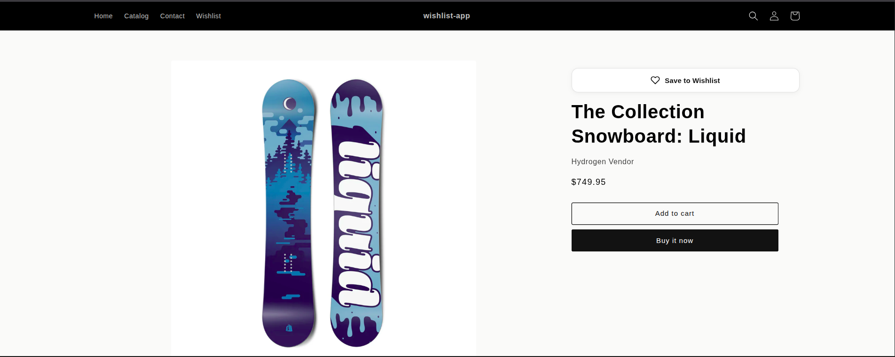
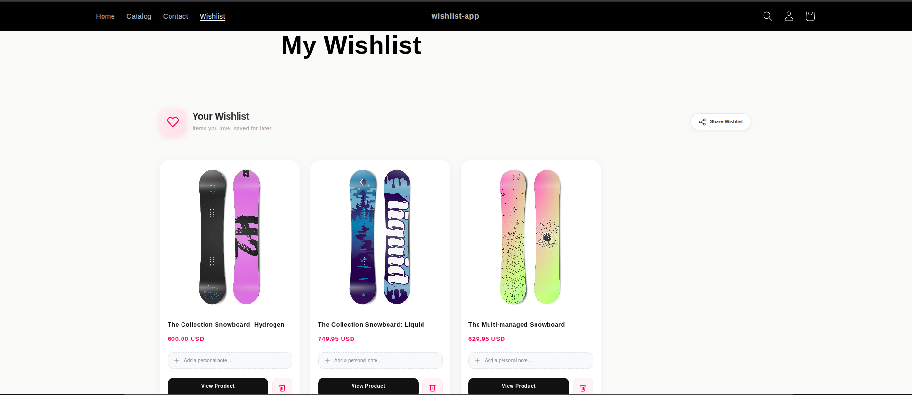
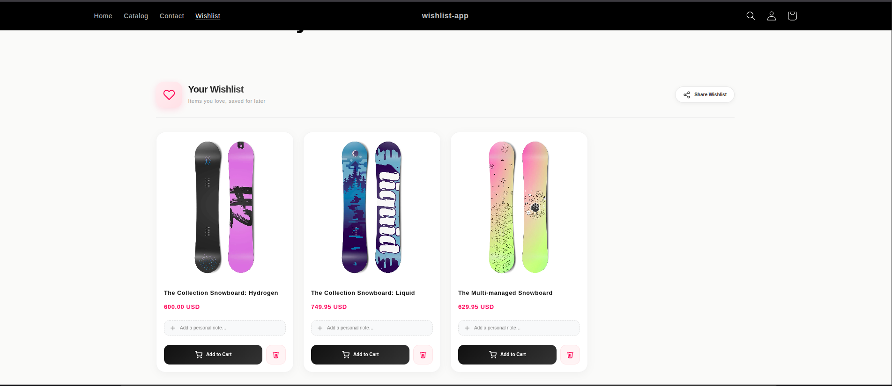
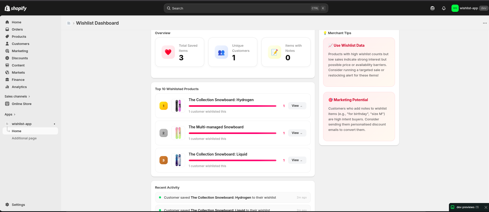

# 🛍️ Advanced Shopify Wishlist App

An enterprise-grade, high-performance Wishlist application for Shopify merchants. Built for modern stores with a focus on **speed, aesthetics, and merchant conversion.**

---

## 🚀 App Overview

This application provides a seamless, "app-like" experience for customers to save their favorite products, organize them with personal notes, and share them with others. 

### Key Design Pillars:
*   **Visual Excellence:** Premium UI with glassmorphism, spring-physics animations, and particle effects.
*   **Decoupled Architecture:** Business logic is isolated from routes for maximum maintainability.
*   **Optimistic Flow:** Instant feedback on customer actions to eliminate perceived latency.
*   **Guest-First Experience:** Persistent wishlist support for non-logged-in users via secure tokens.

---

## ✨ Core Features

### 1. The "Pulse" Heart Button (PDP)
A high-engagement add-to-wishlist button placed directly on the Product Detail Page.
*   **Heart Particles:** Exploding particle effect on "Add" to provide positive micro-feedback.
*   **Persistence:** State is fetched asynchronously and cached for near-instant loading.
*   **Admin Toggle:** Easy "Add to Wishlist" button on every product page.

### 2. Modern Grid Layout Command Center
A dedicated storefront page located at `/pages/my-wishlist` where users manage their favorites.
*   **Note-Taking UI:** A collapsible, elegant text area where users can add personal context (e.g., "Size M for Gifting").
*   **Adaptive Grid:** Responsive layout that looks stunning on mobile and desktop.
*   **Remove with Style:** Slide-out animations for a smooth item deletion experience.

### 3. One-Click "Add to Cart"
A high-conversion feature that allows users to move items from their wishlist directly into their shopping cart.
*   **Seamless AJAX Integration:** Uses the Shopify Cart API to add items without a page reload.
*   **Visual Confirmation:** The button transforms into a "Added!" state with a green success indicator.
*   **Automatic Variant Selection:** Intelligently selects the default product variant for immediate purchase.

### 4. Social Sharing & Gift Registry

### 4. Merchant Analytics Dashboard
A professional Admin UI built within the Shopify Admin for business insights.
*   **Top 10 Rankings:** Visual bar charts showing trending products.
*   **Engagement Badges:** Gold, Silver, and Bronze badges for the most-saved items.
*   **Recent Activity:** Real-time feed of the latest items added by customers.
*   **Top Products:** Visual chart showing which products are most desired.

---

## 🏗️ Architectural Excellence

### service-oriented Architecture (SOA)
We decoupled the standard "Monolithic Route" Shopify structure into clean service layers:
*   **`WishlistService`**: Encapsulates 100% of the Prisma/SQLite database interactions. 
*   **`ProductService`**: Handles the complexities of the Shopify Admin GraphQL API (hydration, featured images, nested pricing).

### Technical Performance
*   **App Proxy Routing:** All storefront requests use the proxy (`/apps/wishlist`) to ensure **Zero CORS issues** and better security.
*   **Optimistic UI Updates:** State is updated locally first, then synced with the server in the background.
*   **Batched Hydration:** We use a single, batched GraphQL query to fetch all 10 products on the dashboard, reducing server load.

---

## 🛠️ Setup & Local Development

### Prerequisites
*   Node.js v20+
*   Shopify CLI

### Installation
1.  Clone the repository and run `npm install`.
2.  Init the database: `npx prisma migrate dev`.
3.  Run the server: `npm run dev`.

---

## ✅ Final Result Checklist

- [x] **Add/Remove Button** with animations on PDP.
- [x] **My Wishlist Page** with grid layout.
- [x] **Personal Notes** system with Slide-in UI.
- [x] **Social Share** with Modal and fallback copy.
- [x] **Guest Support** via LocalStorage persistence.
- [x] **Merchant Dashboard** with Activity, Trends, and Analytics.
- [x] **Modern Architecture** (Service-layer separation).

---

## 📸 Screenshots Guide
*Note for Evaluator: Please refer to the `/screenshots` directory in this repository for full-resolution captures of the app in action.*

1.  **./screenshots/pdp-active.png**: The heart button in its "Saved" state.
2.  **./screenshots/wishlist-grid.png**: The main wishlist page showing 3+ items.
3.  **./screenshots/note-ui.png**: The expanded "Add Note" textarea with premium styling.
4.  **./screenshots/share-flow.png**: The "Share Wishlist" modal open.
5.  **./screenshots/admin-main.png**: The full Merchant Dashboard view.
