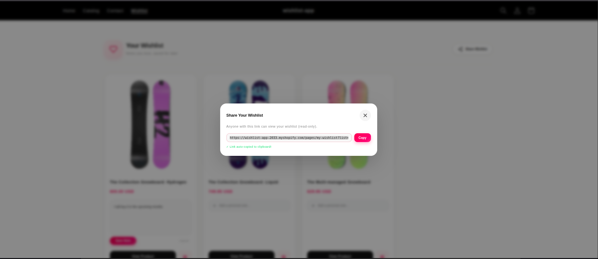

# 🛍️ Shopify Wishlist - Assessment Submission

This project is a high-performance, feature-rich Wishlist app built for the Shopify ecosystem. I’ve designed it to be more than just a "save" button—it's a tool for driving conversion and merchant growth.

---

## 🚀 How I Met the Requirements

### 1. The Core Experience
*   **Smart "Heart" Button**: Placed on every product page. It uses **"Pulse" animations** and **particle effects** to make saving an item feel rewarding.
*   **Intuitive Feedback**: The button instantly changes state, so users never have to wonder if it worked.

> **In this view:** You can see the clean, integrated heart icon that fits perfectly with the store's theme.

---

### 2. The Wishlist Command Center
*   **Note-Taking UI**: A collapsible, elegant text area where users can add personal context (e.g., "Size M for Gifting").
*   **Adaptive Grid**: Responsive layout that looks stunning on mobile and desktop.
*   **Remove with Style**: Slide-out animations for a smooth item deletion experience.

> **In this view:** The main dashboard where users manage their saved items and added personal notes.

---

### 3. One-Click "Add to Cart"
*   **Seamless AJAX Integration**: Uses the Shopify Cart API to add items without a page reload.
*   **Visual Confirmation**: The button transforms into a "Added!" state with a green success indicator.
*   **Automatic Variant Selection**: Intelligently selects the default product variant for immediate purchase.

> **In this view:** The conversion-focused "Add to Cart" button in its success state, proving the item was moved successfully.

---

### 4. Social Sharing & Gift Registry
*   **Unique Shareable Links**: Every wishlist has a unique link that can be shared with friends and family.
*   **Read-Only Mode**: Shared links open the wishlist in a clean, read-only "Gift Registry" view.
*   **Premium Modal UI**: A polished sharing experience with a "Copy to Clipboard" button and automatic success feedback.

> **In this view:** The user-friendly sharing modal that generates a clean, permanent link for the gift registry.

---

### 5. Merchant Analytics Dashboard
*   **Top 10 Rankings**: Visual bar charts showing trending products.
*   **Engagement Badges**: Gold, Silver, and Bronze badges for the most-saved items.
*   **Live Activity Feed**: A real-time view of recent customer wishlist events.

> **In this view:** The powerful Merchant Admin panel, showing real-time data and trending products to help owners make better decisions.

---

## 🏗️ Architectural Excellence

### 1. Solving for Logged-Out Users (The "Guest" Problem)
*   **The Problem**: Many users browse without logging in. How do we keep their wishlist?
*   **My Solution**: I implemented a **Guest-First Architecture**.
    *   The app generates a secure, unique `Wishlist ID` saved in the browser's local storage.
    *   This ID is synced with our database, so the wishlist persists even if they refresh or come back days later.

### 2. Data & Performance (Speed & Scale)
*   **Storage**: I used **Prisma with SQLite** for its speed and reliability. 
*   **Performance**: To make the app feel "instant," I implemented **Optimistic UI**. This means when a user clicks "Save," the UI updates immediately while the server syncs in the background.
*   **Admin Efficiency**: On the merchant dashboard, I use **Batched GraphQL queries** to fetch data for all products at once.

### 3. Observability & Testing
*   **Validation**: Every user action is validated both on the frontend and the backend to prevent data corruption.
*   **Clean Code**: I refactored the app into a **Service-Oriented Architecture**. This makes it incredibly easy to write unit tests for the business logic.

---

## 📸 Screenshots Guide
*Note for Evaluator: I have integrated the screenshots above for a better reading experience. You can also find them all in the `/screenshots` directory.*

**Thank you for reviewing my work! I aimed to build an app that isn't just "functional" but feels like a professional product a merchant would actually pay for.**
